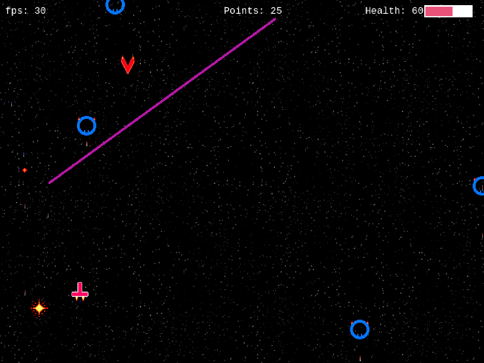
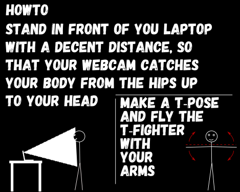

# T-Fighter

A prototype game to control a spaceship with your body.

Uses the webcam with googles posenet to identify you in a T-POSE
in front of you camera and with your arms lean to the left / right
you steer the spaceship.

## DEMO

[Github Pages hosted DEMO](https://derandreas-dt.github.io/phaser-posenet-spaceshooter/)

This little demo is hosted on GitHub Pages and served from the dist folder.
So should be latest build with the newest bugs :)

## Images and HowTo

## TODO

  * a lot, very early prototype
  * enable auto shooting
  * powerups
  * different laser types
  * more enemies
  * levels
  * death
  * is it a game though?

## NOTES

  * first game with phaser v3
  * don't mind the crappy design of the game

## Mentions

  * based on the phaser template by Yandeu [Github Link](https://github.com/yandeu/phaser-project-template)
  * uses tensorflow posenet [GitHub Link](https://github.com/tensorflow/tfjs-models/tree/master/posenet)
  * game logic based on Jared York [Blog Link](https://learn.yorkcs.com/category/tutorials/gamedev/phaser-3/build-a-space-shooter-with-phaser-3/)

## License

MIT License
